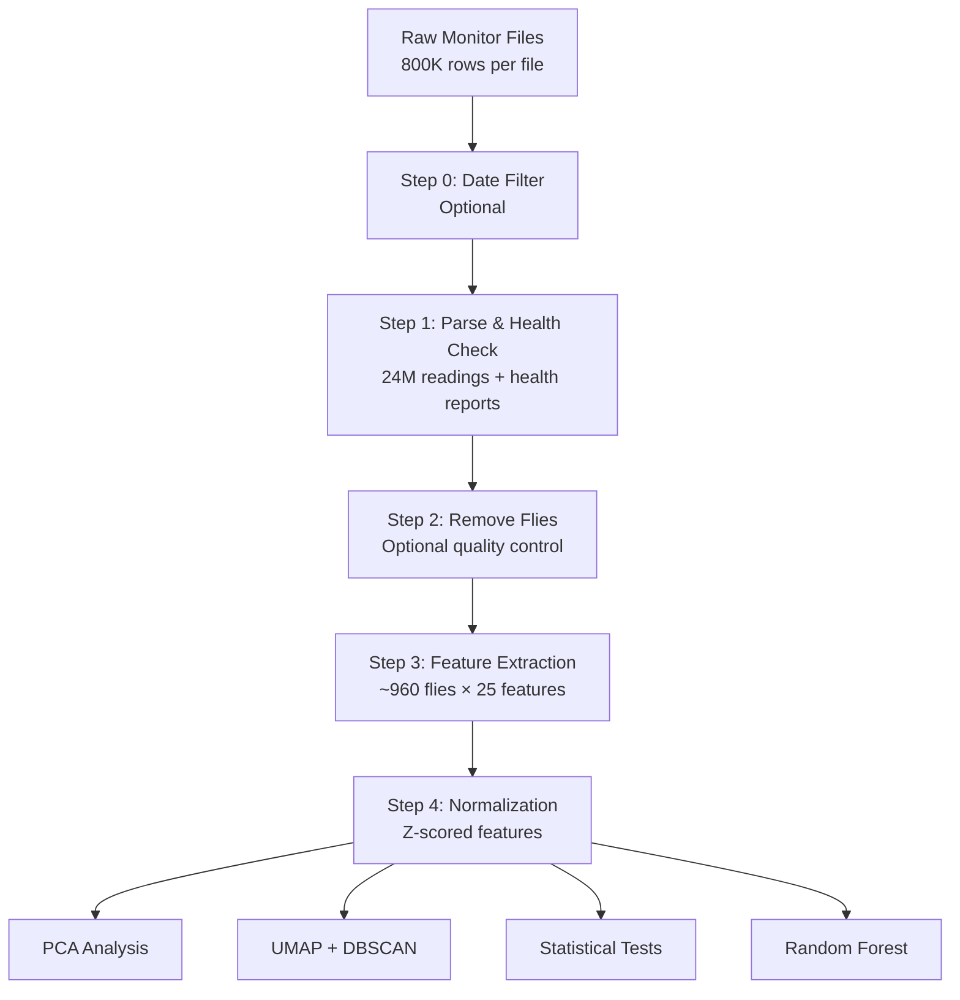

# Flyght Patterns

> A scalable computational framework for multivariate analysis of *Drosophila* sleep and circadian behavior

[](https://www.python.org/downloads/)
[](LICENSE)
[](https://www.postgresql.org/)
[](https://www.timescale.com/)

## Overview

Flyght Patterns is an integrated machine learning pipeline for extracting and analyzing behavioral features from Drosophila Activity Monitor (DAM) time-series data. The framework transforms high-dimensional temporal recordings into structured feature sets, enabling multivariate statistical analysis and unsupervised discovery of behavioral phenotypes.

### Key Features

- **Automated Feature Extraction**: Computes 25+ circadian rhythm and sleep architecture metrics per individual
- **Scalable Database Architecture**: PostgreSQL with TimescaleDB for efficient time-series storage (24M+ data points)
- **Quality Control**: Automated health classification and dead-fly detection
- **Multivariate Analysis**: Integrated PCA, UMAP, and DBSCAN clustering workflows
- **Dual Implementation**: Python (primary) and R pipelines for cross-validation
- **Reproducible Workflows**: Modular design with independent processing steps

## Table of Contents

- [Installation](#installation)
- [Quick Start](#quick-start)
- [Pipeline Overview](#pipeline-overview)
- [Usage](#usage)
- [Feature Documentation](#feature-documentation)
- [Analysis Methods](#analysis-methods)
- [Project Structure](#project-structure)
- [Citation](#citation)
- [Contributing](#contributing)
- [License](#license)

## Installation

### Prerequisites

- **Python**: 3.8 or higher
- **PostgreSQL**: 13 or higher
- **TimescaleDB**: 2.0 or higher (PostgreSQL extension)
- **R**: 4.0+ (optional, for R pipeline)

### Database Setup

#### macOS (Homebrew)

```bash
# Install PostgreSQL
brew install postgresql@16

# Install TimescaleDB
brew tap timescale/tap
brew install timescaledb

# Start PostgreSQL service
brew services start postgresql@16
```

#### Linux (Ubuntu/Debian)

```bash
# Add TimescaleDB repository
sudo sh -c "echo 'deb https://packagecloud.io/timescale/timescaledb/ubuntu/ $(lsb_release -c -s) main' > /etc/apt/sources.list.d/timescaledb.list"
wget --quiet -O - https://packagecloud.io/timescale/timescaledb/gpgkey | sudo apt-key add -

# Install
sudo apt update
sudo apt install timescaledb-2-postgresql-14

# Configure
sudo timescaledb-tune

# Restart PostgreSQL
sudo systemctl restart postgresql
```

For other platforms, see the [TimescaleDB installation guide](https://docs.timescale.com/install/latest/).

### Python Environment

```bash
# Clone the repository
git clone https://github.com/bedont-lab/flyght-patterns.git
cd flyght-patterns

# Create virtual environment (recommended)
python3 -m venv venv
source venv/bin/activate  # On Windows: venv\Scripts\activate

# Install dependencies
pip install -r requirements.txt
```

### Database Initialization

```bash
cd Python/src/db-pipeline

# Create database and schema
python3 setup_database.py

# Verify setup
psql -h localhost -U your_username -d fly_ml_db -c "\dt"
```

## Quick Start

### 1. Prepare Your Data

Place your DAM monitor files and metadata in the appropriate directories:

```
Python/
├── Monitors_raw/          # Raw monitor files (Monitor51.txt, Monitor52.txt, etc.)
├── Monitors_date_filtered/  # Output from Step 0 (optional)
└── details.txt            # Fly metadata (monitor, channel, genotype, sex, treatment)
```

**Example `details.txt` format:**

```
Monitor  Channel  Genotype    Sex     Treatment
51       ch01     WT          Male    Control
51       ch02     WT          Female  Control
52       ch01     sleep_mut   Male    Control
```

### 2. Run the Pipeline

```bash
cd Python/src/db-pipeline

# Optional: Filter by date range first
python3 0-filter_dates.py --input Monitor51 --load "06/20/25" --days 5 --offset 1

# Step 1: Load data and generate health reports
python3 1-prepare_data_and_health.py

# Step 2: Remove dead/unhealthy flies (optional)
python3 2-remove_flies.py --statuses "Dead,Unhealthy"

# Step 3: Extract behavioral features
python3 3-create_feature_table.py

# Step 4: Clean and normalize features for ML
python3 4-clean_ml_features.py
```

### 3. Run Analysis

```bash
cd analysis/

# PCA analysis
python3 pca_analysis.py --experiment-id 1

# UMAP + DBSCAN clustering
python3 umap_dbscan_analysis.py --experiment-id 1

# Sex difference analysis
python3 sexdiff_analysis.py --experiment-id 1

# Random forest classification
python3 random-forest.py --experiment-id 1
```

## Pipeline Overview



### Processing Steps

| Step | Script | Input | Output | Time |
|------|--------|-------|--------|------|
| 0 | `0-filter_dates.py` | Raw monitors | Date-filtered files | ~1-2 min/file |
| 1 | `1-prepare_data_and_health.py` | Monitor files + metadata | Database: readings, health reports | ~5-15 min |
| 2 | `2-remove_flies.py` | Database readings | Filtered readings | ~1-2 min |
| 3 | `3-create_feature_table.py` | Database readings | Database: features table | ~10-15 min |
| 4 | `4-clean_ml_features.py` | Features table | Database: features_z table | ~1-2 min |

## Usage

### Configuration

Set environment variables for database connection:

```bash
export DB_HOST=localhost
export DB_PORT=5432
export DB_NAME=fly_ml_db
export DB_USER=your_username
export DB_PASSWORD=your_password
```

Or modify `Python/src/db-pipeline/config.py` directly.

### Working with Multiple Experiments

```bash
# List all experiments
python3 delete_experiment.py --list

# Run analysis on specific experiment
python3 3-create_feature_table.py --experiment-id 2
python3 4-clean_ml_features.py --experiment-id 2

# Delete an experiment (with confirmation)
python3 delete_experiment.py --experiment-id 1
```

### Command-Line Options

#### Step 0: Date Filtering

```bash
python3 0-filter_dates.py \
  --input Monitor51 \
  --load "06/20/25" \
  --days 5 \
  --offset 1
```

#### Step 1: Data Preparation

```bash
python3 1-prepare_data_and_health.py \
  --lights-on 9 \
  --lights-off 21 \
  --ref-day 4 \
  --exclude-days 1 7
```

#### Step 2: Fly Removal

```bash
python3 2-remove_flies.py \
  --experiment-id 1 \
  --statuses "Dead,Unhealthy,QC_Fail"
```

#### Step 3: Feature Extraction

```bash
python3 3-create_feature_table.py \
  --experiment-id 1 \
  --exclude-days 1 7 \
  --sleep-threshold 5
```

## Feature Documentation

### Circadian Rhythm Features (Cosinor Analysis)

Extracted via daily cosinor regression: `activity ~ Mesor + A×cos(2πt/24) + B×sin(2πt/24)`

- **Mesor**: Rhythm-adjusted mean activity (baseline level)
- **Amplitude**: Rhythm strength (half of peak-to-trough difference)
- **Phase**: Timing of peak activity (acrophase in hours, 0-24)
- **Rhythmic Days**: Number of days with significant rhythmicity (p < 0.05)

Each parameter includes mean and standard deviation across experimental days.

### Sleep Architecture Features

Sleep defined as ≥5 consecutive minutes of inactivity.

#### Duration Metrics
- **Total/Day/Night Sleep**: Minutes of sleep in each photoperiod
- **Sleep Latency**: Time to first sleep episode in dark phase
- **WASO** (Wake After Sleep Onset): Wake time after initial dark-phase sleep

#### Bout Structure
- **Total/Day/Night Bouts**: Number of sleep episodes
- **Mean/Max Bout Length**: Average and maximum sleep episode duration

#### Fragmentation
- **Bouts per Hour**: Temporal fragmentation of sleep
- **Bouts per Minute Sleep**: Sleep continuity index
- **Mean Wake Bout**: Average wake episode duration

#### Transition Dynamics
- **P_wake**: Probability of transitioning from sleep to wake
- **P_doze**: Probability of transitioning from wake to sleep

### Health Status Classification

Automated decision tree classification:

- **Alive**: Passing all quality thresholds
- **Dead**: ≥24 hrs consecutive inactivity OR ≥12 hrs inactivity + no startle response
- **Unhealthy**: Low activity or excessive sleep + no startle response
- **QC_Fail**: >10% missing data

## Analysis Methods

### Principal Component Analysis (PCA)

Linear dimensionality reduction identifying orthogonal components that explain maximum variance in the 25-dimensional feature space.

**Output:**
- PC loadings (feature contributions)
- Variance explained per component
- PC scores per individual
- Biplots for visualization

### UMAP + DBSCAN

**UMAP** (Uniform Manifold Approximation and Projection): Non-linear dimensionality reduction preserving local neighborhood structure.

**DBSCAN** (Density-Based Spatial Clustering): Identifies dense regions in UMAP space as behavioral clusters; flags outliers as unusual phenotypes.

**Output:**
- 2D UMAP projections
- Cluster assignments
- Outlier detection
- Cluster characterization by genotype/sex

### Statistical Testing

- **Multivariate ANOVA**: Testing for genotype and sex effects in multivariate space
- **Post-hoc tests**: Tukey HSD, Dunn's test for pairwise comparisons
- **Chi-square tests**: Association between cluster membership and biological variables

### Random Forest Classification

Feature importance ranking and phenotype prediction using ensemble decision trees.

**Output:**
- Feature importance scores
- Classification accuracy
- Confusion matrices
- Cross-validation results

## Project Structure

```
flyght-patterns/
├── Python/
│   ├── Monitors_raw/              # Raw DAM files (not tracked)
│   ├── Monitors_date_filtered/    # Date-filtered outputs (not tracked)
│   ├── details.txt                # Fly metadata
│   └── src/
│       ├── db-pipeline/           # Main processing pipeline
│       │   ├── 0-filter_dates.py
│       │   ├── 1-prepare_data_and_health.py
│       │   ├── 2-remove_flies.py
│       │   ├── 3-create_feature_table.py
│       │   ├── 4-clean_ml_features.py
│       │   ├── config.py          # Database configuration
│       │   ├── schema.sql         # Database schema
│       │   ├── setup_database.py  # Database initialization
│       │   └── analysis/          # ML analysis scripts
│       │       ├── pca_analysis.py
│       │       ├── umap_dbscan_analysis.py
│       │       ├── sexdiff_analysis.py
│       │       └── random-forest.py
│       ├── main/                  # Legacy pipeline scripts
│       ├── pipeline/              # Alternative pipeline implementation
│       └── test-scripts/          # Debugging and verification
├── pipeline.r                     # R implementation
├── requirements.txt               # Python dependencies
├── db-pipeline.md                 # Detailed pipeline documentation
├── db-tips.md                     # Database usage tips
└── README.md                      # This file
```

## Database Schema

```sql
-- Experiment metadata
experiments (experiment_id, name, start_date, end_date, lights_on_hour, lights_off_hour)

-- Individual fly metadata (~960 flies)
flies (fly_id, experiment_id, monitor, channel, genotype, sex, treatment)

-- Time-series data (24M+ rows, TimescaleDB hypertable)
readings (measurement_id, experiment_id, fly_id, datetime, reading_type, value, monitor)

-- Health reports per fly
health_reports (health_report_id, experiment_id, fly_id, report_date, status, metrics...)

-- Extracted features per fly (~960 rows × 25 features)
features (feature_id, experiment_id, fly_id, mesor_mean, amplitude_mean, ...)

-- Z-scored features for ML (~960 rows × 25 features)
features_z (feature_id, experiment_id, fly_id, mesor_mean_z, amplitude_mean_z, ...)
```

## System Requirements

### Minimum Requirements
- **RAM**: 8 GB (16 GB recommended)
- **Storage**: 10 GB free space (varies with dataset size)
- **CPU**: Multi-core processor recommended

### Memory Usage
- **Data Processing**: ~8-12 GB RAM (sequential file processing)
- **Feature Extraction**: ~4-6 GB RAM peak
- **ML Analysis**: ~500 MB RAM (operates on feature table)

### Performance
- **Processing**: ~960 flies in ~30 minutes total
- **Feature Extraction**: ~10-15 minutes
- **Analysis**: ~1-5 minutes per method

## Troubleshooting

### Database Connection Issues

```bash
# Test PostgreSQL connection
psql -h localhost -U your_username -d fly_ml_db

# Check TimescaleDB extension
psql -d fly_ml_db -c "SELECT * FROM pg_extension WHERE extname = 'timescaledb';"
```

### Memory Errors

If processing fails with memory errors:
- Process monitors sequentially (modify `DEFAULT_DAM_FILES` in scripts)
- Increase system swap space
- Use a machine with more RAM

### Import Errors

```bash
# Verify Python environment
python3 --version  # Should be 3.8+

# Reinstall dependencies
pip install --upgrade -r requirements.txt
```

## Citation

If you use this pipeline in your research, please cite:

```bibtex
@article{flyght-patterns2024,
  title={A Scalable Computational Framework for Multivariate Analysis of Drosophila Sleep and Circadian Behavior},
  author={[Your Name] and [Co-authors]},
  journal={[Journal Name]},
  year={2024},
  note={In preparation}
}
```

## Contributing

We welcome contributions! Please see our contributing guidelines:

1. Fork the repository
2. Create a feature branch (`git checkout -b feature/amazing-feature`)
3. Commit your changes (`git commit -m 'Add amazing feature'`)
4. Push to the branch (`git push origin feature/amazing-feature`)
5. Open a Pull Request

### Code Style

- **Python**: Follow PEP 8 guidelines
- **Documentation**: Use docstrings for all functions
- **Comments**: Explain the "why", not the "what"

## License

This project is licensed under the MIT License - see the [LICENSE](LICENSE) file for details.

## Acknowledgments

- **Bedont Lab** for project development and support
- **TimescaleDB** for time-series database optimization
- **scikit-learn**, **UMAP**, and **pandas** communities for excellent tools

## Support

For questions, issues, or feature requests:
- **Issues**: [GitHub Issues](https://github.com/bedont-lab/flyght-patterns/issues)
- **Email**: [your-email@institution.edu]
- **Documentation**: See `db-pipeline.md` for detailed pipeline documentation

## Roadmap

- [ ] Add actogram generation from database
- [ ] Implement additional clustering algorithms (hierarchical, k-means)
- [ ] Add interactive visualization dashboard (Plotly/Dash)
- [ ] Extend to non-standard photoperiods (constant dark, jet lag protocols)
- [ ] GPU acceleration for large datasets
- [ ] Docker containerization for easier deployment

---

**Developed by the Bedont Lab**  
*Advancing behavioral neuroscience through computational methods*
