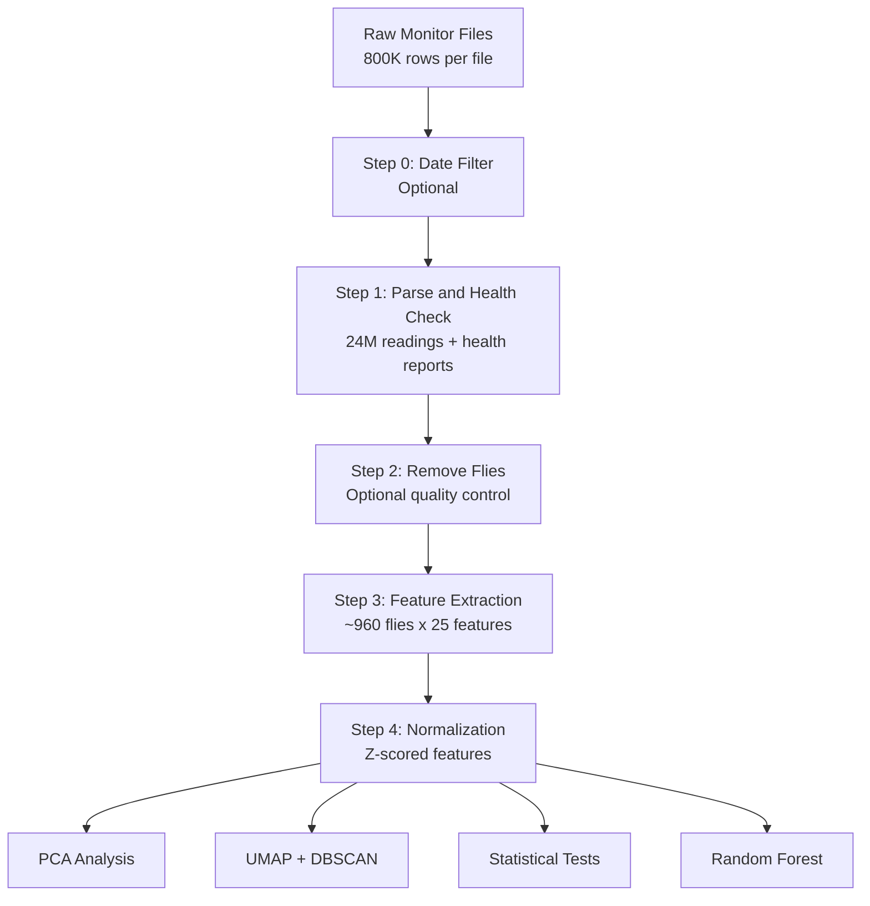

# Flyght Patterns

> A scalable computational framework for multivariate analysis of *Drosophila* sleep and circadian behavior

[](https://www.python.org/downloads/)
[](LICENSE)
[](https://www.postgresql.org/)

---

## Overview

Flyght Patterns is an integrated machine learning pipeline for extracting and analyzing behavioral features from Drosophila Activity Monitor (DAM) time-series data. The framework transforms high-dimensional temporal recordings into structured feature sets, enabling multivariate statistical analysis and unsupervised discovery of behavioral phenotypes.

### Key Features

- **Automated Feature Extraction** — 25+ circadian rhythm and sleep architecture metrics per individual
- **Quality Control** — automated health classification and dead-fly detection
- **Dual Pipeline** — CSV-based (no database required) and SQL/PostgreSQL backends
- **Multivariate Analysis** — integrated PCA, UMAP, DBSCAN clustering, and Random Forest workflows
- **Death Prediction** — XGBoost on rolling behavioral windows (SQL pipeline)
- **Reproducible Workflows** — modular design with independent processing steps

---

## Getting Started

**See [`Python/QUICKSTART.md`](Python/QUICKSTART.md)** — a one-page guide that helps you choose between the CSV and SQL pipelines, then points you to the right step-by-step instructions.

**Prerequisites:**
- Python 3.8 or higher
- PostgreSQL 13+ (SQL pipeline only)
- R 4.0+ (optional, for R pipeline)

```bash
git clone https://github.com/crawfordb2026/flyght-patterns.git
cd flyght-patterns
pip install -r requirements.txt
```

---

## Pipeline Overview


```mermaid
graph TD
    A[Raw Monitor Files\n800K rows per file] --> B[Step 0: Date Filter\nOptional]
    B --> C[Step 1: Parse and Health Check\n24M readings + health reports]
    C --> D[Step 2: Remove Flies\nOptional quality control]
    D --> E[Step 3: Feature Extraction\n~960 flies x 25 features]
    E --> F[Step 4: Normalization\nZ-scored features]
    F --> G[PCA Analysis]
    F --> H[UMAP + DBSCAN]
    F --> I[Statistical Tests]
    F --> J[Random Forest]
```

### Processing Steps

```
Step  Script                          Input                     Output                    Time
----  ------------------------------  ------------------------  ------------------------  -----------
0     0-filter_dates.py               Raw monitor files         Date-filtered files       ~1-2 min
1     1-prepare_data_and_health.py    Monitor files + metadata  Readings + health reports ~5-15 min
2     2-remove_flies.py               Readings                  Filtered readings         ~1-2 min
3     3-create_feature_table.py       Readings                  Features table            ~10-15 min
4     4-clean_ml_features.py          Features table            Z-scored features         ~1-2 min
```

Steps 0 and 2 are optional. Steps 1, 3, and 4 are required.

---

## Feature Documentation

### Circadian Rhythm Features

Extracted via daily cosinor regression: `activity ~ Mesor + A*cos(2*pi*t/24) + B*sin(2*pi*t/24)`

- **Mesor** — rhythm-adjusted mean activity (baseline level)
- **Amplitude** — rhythm strength (half of peak-to-trough difference)
- **Phase** — timing of peak activity (acrophase in hours, 0-24)
- **Rhythmic Days** — number of days with significant rhythmicity (p < 0.05)
- **Periodogram Period** — dominant period from Lomb-Scargle analysis (18-30 hr range)
- **Periodogram Power** — rhythm strength from spectral analysis
- **Activity Onset/Offset** — sustained threshold crossings marking start/end of daily activity
- **Interdaily Stability** — consistency of the circadian pattern across days

Each parameter reported as mean and SD across experimental days.

### Sleep Architecture Features

Sleep is defined as 5 or more consecutive minutes of inactivity.

**Duration**
- Total/Day/Night Sleep — minutes of sleep in each photoperiod
- Sleep Latency — time to first sleep episode in the dark phase
- WASO (Wake After Sleep Onset) — wake time after initial dark-phase sleep onset

**Bout Structure**
- Total/Day/Night Bouts — number of sleep episodes
- Mean/Max Bout Length — average and maximum sleep episode duration

**Fragmentation**
- Bouts per Hour — temporal fragmentation of sleep
- Mean Wake Bout — average wake episode duration between sleep bouts

**Transition Dynamics**
- P_wake — probability of transitioning from sleep to wake
- P_doze — probability of transitioning from wake to sleep

### Health Status Classification

Each fly is classified daily:

- **Alive** — passing all quality thresholds
- **Dead** — 24+ hrs consecutive inactivity, or 12+ hrs inactivity with no startle response
- **Unhealthy** — low activity or excessive sleep with no startle response
- **QC_Fail** — more than 10% missing data

---

## Analysis Methods

### PCA — Principal Component Analysis

Linear dimensionality reduction identifying orthogonal components that explain maximum variance in the 25-dimensional feature space. Outputs PC scores per fly, loadings per feature, and genotype signature heatmaps.

### UMAP + DBSCAN — Unsupervised Clustering

**UMAP** (Uniform Manifold Approximation and Projection) performs non-linear dimensionality reduction preserving local neighborhood structure. **HDBSCAN** then identifies dense regions as behavioral clusters and flags outliers as unusual phenotypes.

### Statistical Testing

- Multivariate ANOVA for genotype and sex effects
- Post-hoc Tukey HSD and Dunn's tests for pairwise comparisons
- Chi-square tests for cluster-genotype association

### Random Forest Classification

Ensemble decision trees trained to predict genotype from behavioral features. Outputs feature importances, confusion matrices, and cross-validated accuracy.

### Death Prediction (SQL pipeline only)

XGBoost trained on rolling 5-day windows of behavioral features to predict proximity to death. Outputs SHAP feature importances identifying the earliest behavioral signals of decline.

---

## Project Structure

```
flyght-patterns/
|
+-- Python/
|   +-- Monitors_raw/              (raw DAM files, not tracked)
|   +-- Monitors_date_filtered/    (Step 0 output, not tracked)
|   +-- metadata.txt               (fly metadata)
|   +-- QUICKSTART.md              (which pipeline to use -- start here)
|   +-- CSV_PIPELINE.md            (full guide: CSV pipeline)
|   +-- SQL_PIPELINE.md            (full guide: SQL pipeline)
|   |
|   +-- src/
|       +-- csv_pipeline/          (CSV-based pipeline, no database required)
|       |   +-- 0-filter_dates.py
|       |   +-- 1-prepare_data_and_health.py
|       |   +-- 2-remove_flies.py
|       |   +-- 3-create_feature_table.py
|       |   +-- 4-clean_ml_features.py
|       |
|       +-- sql_db_pipeline/       (SQL/database pipeline)
|           +-- 0-filter_dates.py
|           +-- 1-prepare_data_and_health.py
|           +-- 2-remove_flies.py
|           +-- 3-create_feature_table.py
|           +-- 4-clean_ml_features.py
|           +-- config.py          (database configuration)
|           +-- schema.sql         (database schema)
|           +-- setup_database.py  (database initialization)
|           |
|           +-- analysis/          (ML and statistical analysis scripts)
|               +-- pca_analysis.py
|               +-- umap_dbscan_analysis.py
|               +-- random-forest.py
|               +-- sexdiff_analysis.py
|               +-- cluster_characterization.py
|               +-- rf_vs_pca_loadings.py
|               +-- death_prediction_xgboost.py
|               +-- analysis_results/   (all outputs written here)
|
+-- R/                             (R pipeline)
+-- requirements.txt               (Python dependencies)
+-- sql_db_pipeline.md             (technical reference: SQL pipeline internals)
+-- README.md                      (this file)
```

---

## Database Schema

```
experiments   -- experiment_id, name, start_date, end_date, lights_on_hour, lights_off_hour
flies         -- fly_id, experiment_id, monitor, channel, genotype, sex, treatment
readings      -- measurement_id, experiment_id, fly_id, datetime, reading_type (MT/CT/Pn), value
health_reports -- health_report_id, experiment_id, fly_id, report_date, status, metrics
features      -- feature_id, experiment_id, fly_id, mesor_mean, amplitude_mean, ... (25+ columns)
features_z    -- same as features with _z suffix on all feature columns (z-scored for ML)
features_sliding_window -- rolling 5-day behavioral windows per fly (used for death prediction)
hmm_states    -- Hidden Markov Model health-state predictions per 5-min bin
```

---

## System Requirements

```
Minimum      Recommended
-----------  -----------
RAM: 8 GB    16 GB
Storage: 10 GB free (varies with dataset size)
CPU: multi-core recommended
```

**Approximate runtime for ~960 flies:**

- Data loading (Step 1): 5-15 minutes
- Feature extraction (Step 3): 10-15 minutes
- Analysis scripts: 1-5 minutes each
- Total: ~30 minutes

---

## License

MIT License — see [LICENSE](LICENSE) for details.

## Acknowledgments

Developed by the **Bedont Lab**.  
Thanks to the scikit-learn, UMAP-learn, and pandas communities for their tools.

---

## Support

- **Not sure where to start?** See [`Python/QUICKSTART.md`](Python/QUICKSTART.md)
- **CSV Pipeline (no database):** See [`Python/CSV_PIPELINE.md`](Python/CSV_PIPELINE.md)
- **SQL Pipeline (PostgreSQL):** See [`Python/SQL_PIPELINE.md`](Python/SQL_PIPELINE.md)
- **Technical reference:** See [`sql_db_pipeline.md`](sql_db_pipeline.md) for database internals

## Roadmap

- [ ] Actogram generation from database
- [ ] Additional clustering algorithms (hierarchical, k-means)
- [ ] Interactive visualization dashboard (Plotly/Dash)
- [ ] Non-standard photoperiod support (constant dark, jet lag protocols)
- [ ] Docker containerization for easier deployment

---

*Advancing behavioral neuroscience through computational methods*
